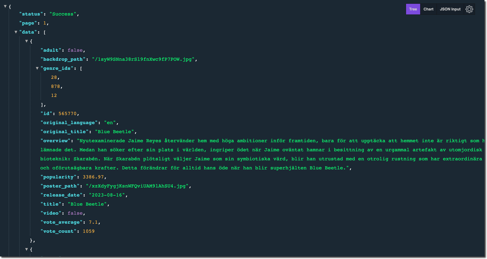
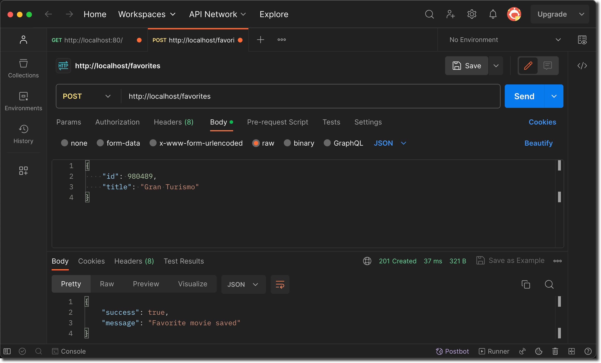
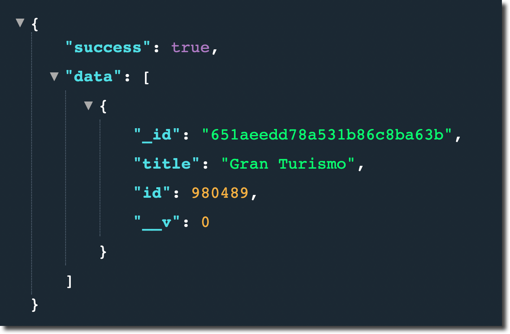

# Multi Container Example

Detta exempel bygger på två projekt samt en MongoDB databas.

I backend katalogen finns ett node.js REST Api.
I frontend katalogen finns en React JS applikation som fungerar som klientapplikation.

Idén här är att placera node och React applikationerna i egna containrar samt att skapa en container med en MongoDB databas.

### Instruktioner

1.  Börja med att skapa ett Docker nätverk.
    Öppna upp en terminal och skriv in följande kommando:
    `docker network create movieflix-net`
2.  Först skapar vi en container för vår MongoDB databas.
    I terminalfönstret skriver vi in följande kommand:
    `docker run -d --rm --name mongodb --network movieflix-net mongo`
    Detta kommando kommer att hämta en mongo image ifrån DockerHub och skapa en container med en tom mongodb databas.
3.  Nu när vi har "containerized" vår databas ska vi skapa en image för vår backend. Navigera till katalogen backend. Börja med att skapa en image för backend applikationen. I terminalfönstret skriv in följande kommando:
    `docker build -t movieflix-api .`
    **!Se till att stå i backend katalogen när ovanstående kommando körs!**
    Detta skapar en image baserat på Dockerfile i backend katalogen.
4.  När vår image är skapad så ska vi skapa en container som ska ingå i samma nätverk som vår mongodb databas. Skriv in följande kommando i terminalfönstret.
    `docker run -d --rm --name movieflix-backend --network movieflix-net -p 80:80 movieflix-api`

    _Observera att vi publicerar porten 80 och kopplar den till den externa porten 80_

5.  Nu har vi satt upp två av tre containrar. Så låt oss nu prova så att allt fungerar som det ska hittills. Öppna upp en webbläsare och skriv in adressen http://localhost och tryck på enter. Vi bör se ett json resultat med de 20 första filmerna ifrån vår externa movie site.
    
    Prova också att ange adress http://localhost/favorites. Vi bör nu se ett json resultat med succes: true och data med en tom array.
6.  Vi kan även prova att lägga till en ny favorit film. Detta görs enklast med en applikation som Postman. Postman kan laddas ner härifrån https://www.postman.com/downloads/. Med postman kan vi skapa POST anrop till vår backend applikation. Exempel anrop.
    
7.  Om vi nu kör om anropet http://localhost/favorites i webbläsaren bör vi nu se att vi har lagt till en favorit film.
    
8.  Nu när vi har bekräftat att våra två containrar fungerar så kan vi fokusera på vår frontend applikation (_React_). Navigera in i frontend applikation öppna upp Dockerfile för att inspektera den. Observera att vi använder node som bas image även för React. Observera även att vi av dokumentationsskäl även exponerar porten 3000. Porten 3000 är standard porten för en React applikation.
9.  I terminalfönstret skriver vi in följande kommando:
    `docker build -t movieflix-react .`
10. Nu har vi en image för vår frontend applikation. Låt oss nu slutligen skapa en container för applikationen. Så skriv in följande Docker kommando i terminalfönstret:
    `docker run -d --rm -it -p 3000:3000 --name movieflix-frontend movieflix-react`
    _Observera att vi använder -it flaggan för interactive som behövs för React ska fungera samt att vi inte använder --network flaggan. Anledningen är att React containern endast används för att starta upp webbservern och returnera applikationen till vår webbläsare. Därefter kommunicera webbläsaren direkt med vårt REST Api(backend applikationen)_
11. Om vi nu går tillbaka till webbläsaren och skriver in följande adress http://localhost:3000 så bör vi nu se React applikationen med ett liknande utseende.
    

Det var allt, nu har vi 3 fungerande containrar som är självförsörjande.

